<div align="center">

# 🏦 Customer Churn Prediction System

**An end-to-end Machine Learning portfolio project** that predicts whether a bank customer is likely to churn, built from raw data through EDA, model training, and a deployed interactive web application.

[](https://www.python.org/)
[](https://streamlit.io/)
[](https://scikit-learn.org/)
[](https://pandas.pydata.org/)
[](#-license)
[](#-project-status--honest-notes)

[Live Demo](#-deployment) · [Report an Issue](#-contact) · [Documentation](#-table-of-contents)

</div>

---

## 📌 Table of Contents

- [Overview](#-overview)
- [Business Problem](#-business-problem)
- [Dataset](#-dataset)
- [Project Architecture](#-project-architecture)
- [Tech Stack](#-tech-stack)
- [Workflow](#-workflow)
- [Model Evaluation](#-model-evaluation)
- [Screenshots](#-screenshots)
- [Folder Structure](#-folder-structure)
- [Installation](#-installation)
- [Usage](#-usage)
- [Deployment](#-deployment)
- [Limitations](#-limitations)
- [Future Improvements](#-future-improvements)
- [Project Status / Honest Notes](#-project-status--honest-notes)
- [License](#-license)
- [Contact](#-contact)

---

## 🔍 Overview

This repository contains an **end-to-end machine learning portfolio project** built to demonstrate a complete, realistic ML workflow: business framing → data exploration → preprocessing → model training → evaluation → deployment as an interactive web app.

It is **not** a production banking system — it's a learning-and-showcase project built on a public dataset, intended to demonstrate applied ML and software skills for **Data Analyst / ML Engineer** roles. Model performance, scope, and current limitations are documented honestly in the sections below rather than glossed over.

---

## 💼 Business Problem

Customer churn — when a customer stops doing business with a company — is one of the most expensive problems in banking and subscription-based industries. Acquiring a new customer typically costs significantly more than retaining an existing one, so identifying **which customers are at risk of leaving, before they leave**, lets a business intervene with targeted retention offers.

This project frames churn prediction as a **binary classification problem**: given a customer's profile (demographics, account activity, and product usage), predict the probability that they will churn.

---

## 📊 Dataset

| | |
|---|---|
| **Source** | [Bank Customer Churn Dataset](https://www.kaggle.com/datasets/gauravtopre/bank-customer-churn-dataset) — publicly available on Kaggle |
| **Records** | 10,000 customers |
| **Features** | 10 input features + 1 target |
| **Target** | `churn` — binary (1 = churned, 0 = stayed) |
| **Class balance** | 79.6% stayed / 20.4% churned (imbalanced) |

**Feature description:**

| Feature | Description |
|---|---|
| `credit_score` | Customer's credit score |
| `country` | Country of residence (France / Germany / Spain) |
| `gender` | Male / Female |
| `age` | Customer age |
| `tenure` | Years as a bank customer |
| `balance` | Account balance |
| `products_number` | Number of bank products held |
| `credit_card` | Whether the customer holds a credit card (0/1) |
| `active_member` | Whether the customer is an active member (0/1) |
| `estimated_salary` | Estimated annual salary |

This is synthetic/public sample data, not real customer records — no personal or sensitive information is involved.

---

## 🏗️ Project Architecture

```mermaid
flowchart LR
    A["Raw Data\ncustomer_data.csv"] --> B["Data Cleaning & EDA\n(Jupyter Notebook)"]
    B --> C["Feature Encoding\nOne-Hot Encoding"]
    C --> D["Feature Scaling\nStandardScaler"]
    D --> E["Train/Test Split\n80/20 Stratified"]
    E --> F["Model Training\nLogistic Regression"]
    F --> G["Model Evaluation\nAccuracy · Precision · Recall · F1 · ROC-AUC"]
    G --> H["Serialized Artifacts\nmodel.pkl · scaler.pkl"]
    H --> I["Streamlit Web App\napp.py"]
    I --> J["End User\nChurn Prediction + Probability"]
```



---

## 🛠️ Tech Stack

| Category | Technology |
|---|---|
| **Language** | Python |
| **Data Handling** | Pandas, NumPy |
| **Machine Learning** | Scikit-learn |
| **Model Persistence** | Pickle |
| **Web Application** | Streamlit |
| **Styling** | Custom CSS |
| **EDA & Visualization** | Matplotlib, Seaborn |
| **Development Environment** | Jupyter Notebook / Google Colab |

---

## ⚙️ Workflow

1. **Business & Data Understanding** — defined the churn problem and reviewed dataset shape, types, and quality.
2. **Data Quality Checks** — verified no missing values, no duplicate records, and valid ranges for all numerical fields.
3. **Exploratory Data Analysis** — analyzed churn distribution, age/balance/credit score distributions, and their relationship with churn using histograms, boxplots, count plots, and a correlation heatmap.
4. **Preprocessing**
   - Dropped `customer_id` (identifier, not predictive)
   - One-hot encoded `country` and `gender`
   - Stratified 80/20 train/test split to preserve class balance in both sets
   - Scaled numerical features with `StandardScaler` (fit on train, applied to test — no data leakage)
5. **Model Training** — trained a `LogisticRegression` classifier as a baseline model.
6. **Evaluation** — assessed the model using accuracy, precision, recall, F1-score, a confusion matrix, and ROC-AUC (see below).
7. **Serialization** — saved the trained model and scaler with `pickle` for reuse in the web app.
8. **Deployment** — wrapped the trained model in a Streamlit application for interactive, real-time predictions.

---

## 📈 Model Evaluation

**Being transparent here on purpose** — the metrics below are reported as-is, without cherry-picking, including the ones that don't flatter the model.

The dataset is imbalanced (79.6% stayed / 20.4% churned), which means **raw accuracy is a misleading headline metric**: a model that predicts "stayed" for every customer would already score ~79.6% accuracy without learning anything. So the numbers below are broken out by class rather than summarized as a single accuracy figure.

**Test set results (Logistic Regression, baseline model):**

| Metric | Value |
|---|---|
| Accuracy | 80.8% |
| Precision (churn class) | 58.9% |
| Recall (churn class) | 18.7% |
| F1-score (churn class) | 0.28 |
| ROC-AUC | 0.775 |

**Confusion Matrix:**

| | Predicted: Stayed | Predicted: Churned |
|---|---|---|
| **Actual: Stayed** | 1,540 | 53 |
| **Actual: Churned** | 331 | 76 |

**Honest read of these numbers:** the model correctly identifies stayed customers well, but it only catches **~19% of customers who actually churn**. For a churn model, recall on the churn class is the metric that matters most in practice — this baseline model, as currently trained, is not yet reliable enough for real retention decisions. This is a known, deliberately documented limitation (see [Limitations](#-limitations)) and the next model iteration targets this directly (see [Future Improvements](#-future-improvements)).

---

## 🖼️ Screenshots

> Replace these placeholders with actual screenshots before publishing.

**Main input form:**

`docs/screenshots/app-form.png`

**Prediction result:**

`docs/screenshots/app-result.png`

---

## 📁 Folder Structure

```
Customer-Churn-Prediction/
│
├── app.py                          # Streamlit web application
├── requirements.txt                # Python dependencies
├── assets/
│   └── style.css                   # Custom UI styling
├── data/
│   └── customer_data.csv           # Training dataset
├── models/
│   ├── customer_churn_model.pkl    # Trained Logistic Regression model
│   └── scaler.pkl                  # Fitted StandardScaler
├── notebooks/
│   └── Customer_Churn_Prediction.ipynb   # Full EDA + training notebook
└── README.md                       # Project documentation
```

---

## 💻 Installation

Clone the repository and set up a local environment:

```bash
# 1. Clone the repository
git clone https://github.com/<your-username>/Customer-Churn-Prediction.git
cd Customer-Churn-Prediction

# 2. Create and activate a virtual environment
python -m venv venv
source venv/bin/activate      # On Windows: venv\Scripts\activate

# 3. Install dependencies
pip install -r requirements.txt
```

---

## ▶️ Usage

Run the Streamlit app locally:

```bash
streamlit run app.py
```

Then open the URL shown in your terminal (typically `http://localhost:8501`), fill in a customer's details, and click **Predict** to see the churn prediction and probability.

---

## 🚀 Deployment

This app is built to be deployed on **[Streamlit Community Cloud](https://streamlit.io/cloud)**:

1. Push this repository to GitHub.
2. Go to [share.streamlit.io](https://share.streamlit.io) and sign in with GitHub.
3. Click **New app**, select this repository and branch, and set the main file path to `app.py`.
4. Deploy — Streamlit Cloud will install `requirements.txt` and launch the app automatically.

**🔗 Live Demo:** _add your deployed Streamlit Cloud URL here once live_

---

## ⚠️ Limitations

This project is transparent about what it does **not** yet do well:

- **Low recall on the churn class (~19%)** — the current model misses a majority of actual churners, which limits its usefulness for real retention decisions in its current form.
- **Single model, no hyperparameter tuning** — only a baseline Logistic Regression was trained; no model comparison or tuning has been performed yet.
- **Class imbalance is measured but not yet corrected for** — no class weighting, resampling, or decision-threshold tuning has been applied.
- **No automated tests or CI pipeline** — the codebase does not yet include unit tests.
- **Trained on a static public dataset** — not validated against real-world banking data or production traffic.
- **Not hardened for production** — no logging, monitoring, retraining pipeline, or input schema validation beyond basic UI constraints.

---

## 🔮 Future Improvements

- [ ] Address class imbalance via `class_weight="balanced"`, SMOTE, or decision-threshold tuning to improve churn recall
- [ ] Compare additional model families (Random Forest, Gradient Boosting/XGBoost) with cross-validation
- [ ] Add hyperparameter tuning (`GridSearchCV` / `RandomizedSearchCV`)
- [ ] Engineer additional features (e.g. balance-to-salary ratio, zero-balance flag, tenure buckets)
- [ ] Bundle preprocessing and model into a single `sklearn.Pipeline` artifact
- [ ] Add unit tests and a CI workflow
- [ ] Add model explainability (SHAP/feature importance) to the app
- [ ] Deploy a live public demo link

---

## 📋 Project Status / Honest Notes

This is an actively-improving **learning and portfolio project**, not a finished production product. The current model is a baseline intended to demonstrate the full ML workflow end-to-end; performance improvements from the roadmap above are in progress. Feedback and suggestions are welcome via [Issues](#-contact).

---

## 📄 License

This project is licensed under the [MIT License](LICENSE).

---

## 📬 Contact

**Nadir Khan**
🔗 Portfolio: [nadir789259.github.io](https://nadir789259.github.io)
🔗 GitHub: [@NADIR789259](https://github.com/NADIR789259)

If you found this project useful or interesting, consider ⭐ starring the repository.
